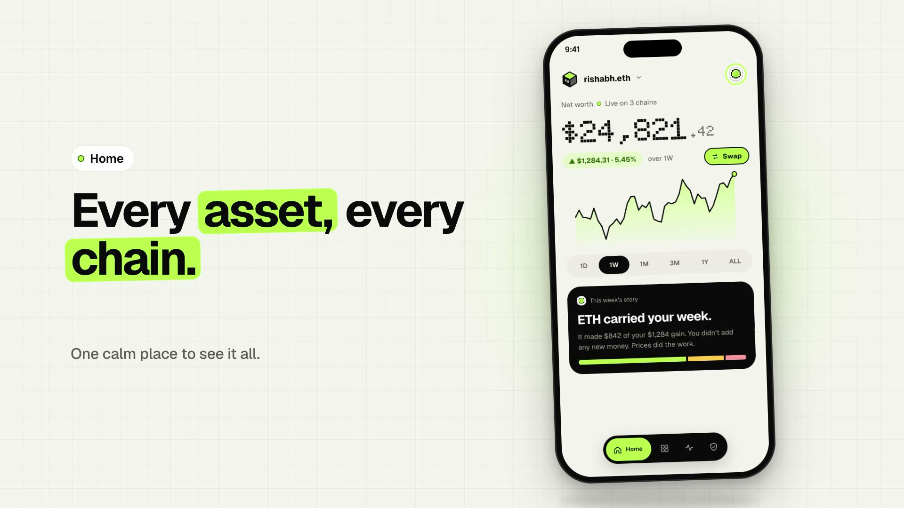

<div align="center">



# 🧊 Cubby

**Your wealth, on-chain.**
A calm, minimal-and-fun crypto portfolio app. See everything you own across **Ethereum, Base and Arbitrum** in one place, understand your activity in plain English, and swap through your own wallet.


</div>

---

## ✨ What is Cubby?

Most crypto apps shout: red, green, rockets, noise. **Cubby is the opposite.** It shows one calm net worth, explains what happened in your wallet, and celebrates *care* (security wins, time on-chain) instead of trades. Its mascot, a voxel vault, grows stronger as your wallet gets safer.

- **View-only by default.** Paste any address or ENS name. No seed phrase, ever.
- **Optional wallet connection** (MetaMask, WalletConnect, Coinbase, …) to swap. Your wallet app signs every step; Cubby never holds keys.
- **Calm by design.** Quiet money screens, delight reserved for stickers, the mascot and milestones. No confetti on price moves.

<div align="center">

</div>

## 🧩 Features

| | |
|---|---|
| 🏠 **Home** | Live net worth (dot-matrix numerals), weekly change, price chart with 1D–ALL ranges, "this week's story" explaining what moved your balance |
| 📊 **Assets** | Every token on every chain, chain filters, 24h change, dust hidden behind a toggle |
| 🔎 **Token detail** | Tap any token: price + chart, your position across chains, market cap / volume / supply / ATH, contract addresses with copy + explorer links, your activity with it |
| 🔁 **Swap** | Quotes via LI.FI, exact-amount approvals, signed in *your* wallet app, calm success animation, appears in Activity instantly |
| 🧾 **Activity** | On-chain history decoded into plain English: swapped, sent, received, minted, staked, approved, failed |
| 🛡️ **Health** | A score and Cubby level from real on-chain token approvals (unlimited / unverified spenders), wallet mix and failed transactions. Revoke opens revoke.cash so you sign in your own wallet |
| 🪐 **Universe** | Your assets as planets: bigger planet, bigger share. Tap to fly in |
| 🎞️ **Recap, Milestones, Sticker book** | A story built from your last 30 days of transactions; stickers earned from real wallet facts (never from trades) |
| 👥 **Accounts** | Save several watched addresses or connected wallets, switch instantly, persisted on device |
| 🌗 **Appearance** | System / Light / Dark, built from one design-token source |

## 🏗️ How it works

```
                 ┌───────────────────────────── UI (React Native) ─────────────────────────────┐
                 │ Welcome → Connect sheet → Main (tabs: Home · Assets · Activity · Health)    │
                 │ Overlays: Universe · Token detail · Swap · Recap · Milestone · Sticker book │
                 └───────────────▲──────────────────────────────▲──────────────────────────────┘
                                 │ context providers            │
        ┌────────────────────────┴───────────┐     ┌────────────┴──────────────┐
        │ state/  accounts · portfolio ·     │     │ state/wallet (Reown       │
        │ activity · health  (cache-first)   │     │ AppKit: connect + sign)   │
        └──────────────────▲─────────────────┘     └────────────┬──────────────┘
                           │                                    │ EIP-1193
        ┌──────────────────┴─────────────────────────────┐      ▼
        │ services/  portfolio · activity · health ·     │   Your wallet app
        │ swap · tokenInfo · history · recap · stickers  │   (MetaMask, …)
        └───▲───────────────▲───────────────▲────────────┘
            │ QuickNode RPC │ CoinGecko /   │ LI.FI quotes
            │ (+ Token API) │ Coinbase      │
            ▼               ▼               ▼
        Ethereum · Base · Arbitrum     prices & history      swap routes
```

**Key ideas**
- **Real data, no backend.** Balances, history and approvals come straight from your QuickNode endpoints. Prices from CoinGecko (Coinbase as fallback). Swap routes from LI.FI.
- **Fast on repeat.** A stale-while-revalidate cache (memory + disk) shows the last known data instantly and refreshes behind it, so switching accounts feels immediate. Private RPC URLs are never written to disk.
- **Polite to rate limits.** A throttled RPC queue with retries and backoff, one batched price request, per-chain failure isolation.
- **Honest derived features.** Health, Recap and Stickers are computed from real approvals and transactions. Anything that can't be known (e.g. weekly check-ins) stays locked rather than faked.
- **Keys never touch Cubby.** Wallet connection and signing go through Reown AppKit; swaps use exact-amount approvals, never unlimited.

## 🧱 Tech stack

React Native 0.87 · TypeScript · React Navigation (native stack) · **Reanimated 4** · react-native-svg · **Reown AppKit** (WalletConnect) + ethers/viem · QuickNode RPC & Token/NFT API · CoinGecko · LI.FI · AsyncStorage · Geist + Doto fonts

## 📁 Project structure

```
.
├── App.tsx                      # Providers (accounts, wallet) + navigator
├── index.js                     # Polyfills first (crypto, WalletConnect), then app
├── src/
│   ├── screens/
│   │   ├── Welcome/             # Landing + animated vault
│   │   ├── connectWallet/       # "Connect a wallet" sheet (wallet apps or watch-only)
│   │   ├── Main/                # Tab shell, overlays, account-keyed providers
│   │   ├── Home/                # Net worth, chart, story, empty-wallet state
│   │   ├── Assets/              # Token list, chain filters, dust toggle
│   │   ├── TokenDetail/         # Full token page
│   │   ├── Swap/                # Swap UI + calm success animation
│   │   ├── Activity/            # Decoded history + filters
│   │   ├── Health/              # Score, Cubby level, approvals
│   │   ├── Universe/            # Planet view with fly-in
│   │   ├── Recap/ Milestone/ StickerBook/
│   ├── services/                # Data layer (no UI)
│   │   ├── portfolio.ts         # Native + token balances across chains
│   │   ├── activity.ts          # History → plain-English records
│   │   ├── health.ts            # On-chain approvals, score, checkup
│   │   ├── swap.ts              # LI.FI quotes, allowance/approve, receipts
│   │   ├── tokenInfo.ts prices.ts history.ts ens.ts rpc.ts cache.ts
│   │   └── recap.ts stickers.ts assets.ts format.ts
│   ├── state/                   # accounts · portfolio · activity · health · wallet
│   ├── components/              # TabBar, SlidingSelector, PressableScale, sheets, charts…
│   ├── art/                     # Mascot, stickers, icons, crypto logos (SVG)
│   ├── motion/                  # Springs, animation hooks, number count-up
│   ├── theme/                   # Design tokens, light/dark, fonts, theme preference
│   └── config/                  # chains · tokens · spenders · appkit · env (git-ignored)
├── assets/
│   ├── fonts/                   # Geist, Doto
│   └── kit/svg/                 # Source SVG art
├── docs/                        # README images
├── ios/ android/               # Native projects
└── __tests__/
```

## 🚀 Getting started

**Prerequisites:** Node ≥ 22, Xcode (iOS), CocoaPods, a [QuickNode](https://www.quicknode.com) account and a free [Reown project ID](https://dashboard.reown.com).

```bash
git clone https://github.com/rishabhvyass/cubby.git
cd cubby
npm install
cd ios && pod install && cd ..

# 1) add your keys (this file is git-ignored)
cp src/config/env.example.ts src/config/env.ts
#    - QUICKNODE_URLS: HTTP endpoints for Ethereum, Base, Arbitrum
#    - REOWN_PROJECT_ID: from dashboard.reown.com

npm start            # Metro
npm run ios          # in another terminal
```

**QuickNode setup:** create one **Mainnet** endpoint per chain. For full token balances and transaction history, enable the **Token and NFT API v2** add-on on each endpoint. Without it Cubby still works: it falls back to a known-token list for balances, but history needs the add-on.

**Testing wallet connection:** use a real iPhone with a wallet app installed (the simulator has none), or choose WalletConnect in the simulator and scan the QR with your phone's wallet.

## 🎨 Design

Cubby has its own small design system: paper `#F4F4EF`, ink `#0A0A0A`, lime `#B8FF4A`; Geist for UI and **Doto** (dot-matrix) for headline numbers only; hard-offset tactile buttons; springs for motion (calm, no bounce on money). Rules the app follows: celebrate care not trades, status is never colour-only (▲ ▼ —), Reduce Motion respected, 44pt tap targets.

## ⚠️ Known limitations

- **iOS is the tested platform.** Android is configured but untested.
- **Base / Arbitrum history** needs the QuickNode add-on on those endpoints; otherwise Activity, Recap and some stickers only cover chains that have it.
- **Prices** use CoinGecko's free tier (rate-limited); Coinbase is a fallback for ETH and known tokens, and chart history can be missing during throttling.
- **Phantom** appears in the wallet list, but Solana isn't supported yet; Cubby tracks Ethereum, Base and Arbitrum.
- **Approvals** are discovered from your own `approve()` history plus common apps and tokens, so unusual old approvals can be missed.
- **Haptics** are stubbed (no native haptics package installed yet).
- Swap has been exercised with small amounts; treat it as beta and review every request in your wallet.

## 🗺️ Roadmap

NFT and DeFi tabs · Solana · push-style alerts for risky approvals · share cards for recaps · Android polish · richer wallet-age and check-in streaks

## 🔐 Security

Cubby never asks for or stores a seed phrase or private key. Wallet connections are brokered by Reown AppKit and every transaction is approved in your own wallet app. API keys live in a git-ignored `src/config/env.ts`; the cache never persists RPC URLs.

## 🙏 Credits

Token, chain and wallet logos from [web3icons](https://github.com/0xa3k5/web3icons) (MIT, trademarks belong to their owners). Swap routing by [LI.FI](https://li.fi). Wallet connection by [Reown](https://reown.com). Fonts: Geist, Doto.

---

<div align="center">Made with a calm mind. <b>Your wealth, on-chain.</b> 🧊</div>
